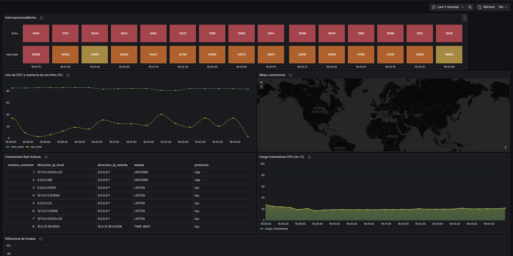
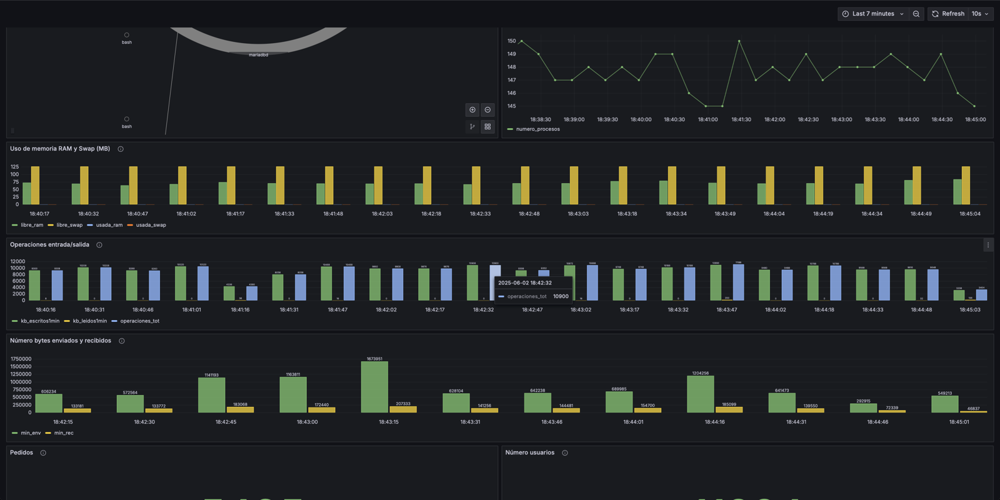

# Pruebas de carga y monitorización de una tienda online

Desarrollo de una tienda online con API REST (**Flask + MariaDB**), **pruebas de carga con [Locust](https://locust.io/)** y **monitorización del servidor con Grafana** para encontrar el punto de saturación del sistema.

📄 **[Informe completo (PDF, 50 págs.)](Informe_Pruebas_Carga.pdf)**: implementación de la API, script de Locust, dashboards de Grafana y análisis de cada prueba.

> Práctica de la asignatura *Evaluación de Sistemas Informáticos* (3º Grado en Ingeniería Informática, Universidad de Valladolid, junio de 2025).



## Qué se hizo

1. **Aplicación "Arte Visual"**: tienda de pósters en Flask con API RESTful para autenticación (contraseñas con *hash*), catálogo, carrito y pedidos, sobre MariaDB.
2. **Script de Locust** (`locustfile.py`): usuarios virtuales que inician sesión y ejecutan tareas **ponderadas** que imitan un uso real de la tienda.
3. **Dashboard de Grafana** con métricas del servidor (CPU, memoria, E/S de disco, red, procesos, conexiones) y métricas de negocio sacadas de la base de datos (pedidos y usuarios registrados).
4. **6 escenarios de carga creciente**, de 10 a 200 usuarios concurrentes, analizando juntos los datos de Locust y los de Grafana.

### Tareas simuladas

| Endpoint | Método | Peso | Descripción |
|---|---|---|---|
| `/api/productos` | GET | 10 | Listado de productos |
| `/api/cart/add` | POST | 8 | Añadir al carrito (el stock insuficiente se trata como respuesta válida) |
| `/api/productos/{id}` | GET | 5 | Detalle de producto |
| `/api/carrito` | GET | 4 | Ver carrito |
| `/api/menu`, `/api/pedidos` | GET | 3 | Menú y pedidos |
| `/api/productos/{id}` | PATCH / PUT | 2 / 1 | Actualización parcial / completa de productos |
| `/api/pedidos/{id}` | GET | 2 | Detalle de un pedido creado por el propio usuario |
| `/api/checkout` | POST | 1 | Compra, validando la respuesta y guardando el `order_id` |
| `/api/registro`, `/api/carrito/vaciar` | POST / DELETE | 1 | Alta de usuarios y vaciado del carrito |

## Resultados

Datos de Locust de cada escenario (usuarios concurrentes / tasa de llegada / duración). Los CSV completos están en [`resultados/`](resultados/).

| Usuarios | Llegada | Duración | Peticiones | Peticiones/s | Mediana (ms) | P95 (ms) | Errores |
|---:|---:|---:|---:|---:|---:|---:|---:|
| 10 | 2/s | 1 min | 160 | 4,8 | 11 | 170 | 0,00 % |
| 25 | 5/s | 2 min | 1483 | 12,4 | 10 | 130 | 0,00 % |
| 50 | 10/s | 3 min | 4411 | 24,5 | 11 | 250 | 0,05 % |
| 100 | 20/s | 5 min | 14272 | 47,6 | 22 | 360 | 0,11 % |
| 150 | 30/s | 5 min | 19371 | 64,6 | 190 | 1000 | 0,24 % |
| 200 | 50/s | 5 min | 20117 | 67,1 | 730 | 1800 | 0,38 % |

**Conclusiones**

- El sistema funciona de forma estable **hasta unos 50 usuarios concurrentes**, con medianas de unos 10 ms.
- **Entre 100 y 150 usuarios el sistema se satura**: la mediana se multiplica por casi 9, el P95 llega a 1 s y el rendimiento deja de crecer (unas 65 peticiones/s).
- Grafana muestra que el **cuello de botella es la CPU**, con picos por encima del 80-90 %. La memoria se mantiene estable.
- Los únicos errores son respuestas `400` de `/api/checkout` al intentar pagar con el carrito vacío: es una validación correcta del backend, no un fallo.
- Mejoras propuestas: optimizar consultas SQL, añadir caché y escalar horizontal o verticalmente.



## Cómo ejecutarlo

```bash
pip install -r requirements.txt
locust -f locustfile.py --host http://<servidor>:5000
# abrir http://localhost:8089 y configurar usuarios y tasa de llegada
```

Modo sin interfaz, exportando CSV:

```bash
locust -f locustfile.py --host http://<servidor>:5000 --headless -u 100 -r 20 -t 5m --csv resultados/prueba
```

## Autores

Grupo 02: **Alfredo del Val Ramos** ([@Krazyfred](https://github.com/Krazyfred)), Daniel García Salinas, Francisco Iván San Segundo Álvarez y Gabriel Ferrero Herrera.
